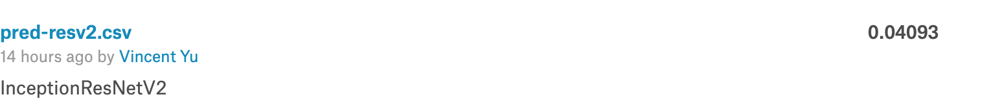

# Machine Learning Engineer Nanodegree 

[毕业项目: 猫狗大战](https://github.com/nd009/capstone/tree/master/dog_vs_cat)

[Dogs vs. Cats Redux: Kernels Edition](https://www.kaggle.com/c/dogs-vs-cats-redux-kernels-edition)

## 数据集获取

使用 [Dogs vs. Cats Redux: Kernels Edition](https://www.kaggle.com/c/dogs-vs-cats-redux-kernels-edition)提供的数据集合。

获取步骤如下:

1. 注册``kaggle``。
2. 进入 [Dogs vs. Cats Redux: Kernels Edition/rules](https://www.kaggle.com/c/dogs-vs-cats-redux-kernels-edition/rules)，接受规则。
3. ``pip install kaggle`` 安装``kaggle api``工具。
4. 使用``kaggle competitions download -c dogs-vs-cats-redux-kernels-edition``下载数据。

``kaggle api``的使用，可以参照[官方文档](https://github.com/Kaggle/kaggle-api)。

数据集需要处理成如下格式，见报告中说明。

```
.
|----train
| |----cat
| | |----cat.1.jpg
| |----dog
| | |----dog.1.jpg
|----validation
| |----cat
| | |----cat.2.jpg
| |----dog
| | |----dog.2.jpg
|----test
| |----1.jpg
|----input
| |----train
| | |----cat.1.jpg
| | |----dog.1.jpg
| | |----dog.2.jpg
| | |----cat.2.jpg
| |----test
| | |----1.jpg
| | |----2.jpg
```


## 文件说明

* project-final.ipynb 项目完整源码
* project-final.html 项目导出html
* data_process.ipynb 数据处理相关
* data_process.html 数据处理相关网页
* pred-final.csv 生成预测数据，``kaggle``测试0.0493
* report.pdf 毕业报告


## 其他说明

1. 使用每个预训练模型提取特征，在5,000个输入文件时，每个大概要15分钟，p2.xlarge的机子上。
2. 如果报库未引入，可能是上面某个cell没执行到。
3. kaggle分数


