# 机器学习工程师纳米学位毕业项目
俞伟山  
September 3th, 2018

猫狗大战（[Dogs vs. Cats Redux: Kernels Edition](https://www.kaggle.com/c/dogs-vs-cats-redux-kernels-edition)）。


## 1 定义

### 1.1  项目概览

此项目最早源于``Kaggle`` 2013年的[Dogs vs. Cats](https://www.kaggle.com/c/dogs-vs-cats)比赛。那时，网站为了防止恶意攻击，一般会提供一些验证问题，用来区别人和机器，即 ``CAPTCHA``(Completely Automated Public Turing test to tell Computers and Humans Apart) 。这些问题，要设计得容易让人解决，而让计算机不好解决。在那时，``Asirra`` (Animal Species Image Recognition for Restricting Access)，就是人容易解决，而计算机不好解决的问题。

猫狗大战属于图像识别的问题，那时已经有了一些机器学习算法应用于图像识别，文献[1] 使用机器学习算法，可以在猫狗的图像识别中，达到``80%``的分类准确率。

随着这几年机器学习的发展，特别是深度学习和图像分析的发展，各种深度学习框架、``ConvNet``模型相继出现。``Kaggle``于2017年，再次举办了猫狗大战的比赛，排在第一名的，``LogLoss``得分达到了``0.03302``。

图像识别问题，属于``计算机视觉``领域。``计算机视觉``是一个跨学科的领域，它处理计算机如何高度理解数字图像或视频的问题。它包含如何自动从图像和视频中抽取、分析和理解一些有用的信息。

图像识别是``计算机视觉``的典型问题。目前，最好的解决图像识别问题的算法是基于``ConvNet``的算法。2012年，``Alex Krizhevsky``使用``AlexNet``在``ImageNet``举办的``ILSVRC-2012``中达到了 ``15.3%``的top-5错误率[2]，领先第二名的``26.2%``，被认为是深度学习的革命。

本人对``计算机视觉``比较感兴趣，而用深度``ConvNet``来处理图像识别问题又是目前比较常见的操作，所以，我选择这个毕业项目。


### 1.2 问题说明
本次项目使用深度学习方法识别一张图片是猫还是狗。

- 输入：一张彩色图片
- 输出：狗的概率

图片来源主要是``petfinder``网站，一家致力于帮人们找回宠物、收养流浪狗的网站。网站提供的图片都是真实的图片，所以会看到很多真实而又复杂的场景。比如，猫狗和人的合影、寻找猫狗的广告、一张图片出现多只猫、猫狗同时出现、猫狗品种多样、姿态万千，都增加了分类的难度。还有图片像素不一，需要进行数据预处理。

这个问题是典型的有监督图像二分类问题，训练数据集有2,5000张标注为猫狗的图片，需要我们对数据进行有监督学习，并做最后的二分类。

使用``ConvNet``最适合解决图片识别问题。它会通过卷积层的滤波器，来学习图片的特征。通过深度的卷积网络，当深度越深时，可以学习到的特征越复杂，复杂的特征由前几层学习的基础特征组合而成。

学习到图片特征后，就可以进行对象分类了，可以使用``softmax``和``sigmoid``等进行最后的分类。


### 1.3 指标

早期，2013年的版本，评估是用的简单的``accuracy``，但是在``ConvNet``模型横行的时代，使用简单的几层``ConvNet``就能达到``90%``以上的准确度。

``LogLoss``方法提供了更精细的项目指标，项目的评估指标参见 [Dogs vs. Cats Redux: Kernels Edition Evaluation ](https://www.kaggle.com/c/dogs-vs-cats-redux-kernels-edition#evaluation) 。它根据``LogLoss``来评估，``LogLoss``越低越好。

``LogLoss``定义如下：

$$ \textrm{LogLoss} = - \frac{1}{n} \sum_{i=1}^n \left[ y_i \log(\hat{y}_i) + (1 - y_i) \log(1 - \hat{y}_i)\right]$$ 

其中:

- n 是测试集的大小。
- $\hat{y}_i$ 是预测的图片是狗的概率。
- $y_i$ 是真实值，是狗时为1，是猫时为0。
- $\log()$ 是自然对数。

在``keras``中，``loss函数``使用``binary_crossentropy``即是``LogLoss``。


## 2 分析

### 2.1 数据可视化

本次数据集使用项目提供的数据集。它提供了25,000张猫狗图片用来训练，其中标记为猫狗的图片各半。猫狗图片通过文件名来区分。

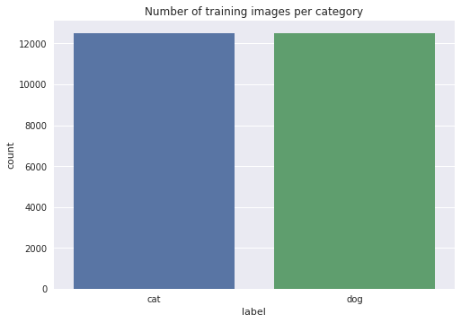


我们显示前5张狗，前5只猫的图片，可以看到图片像素质量不一，猫狗品种、姿态等场景都不一样。图片的大小尺寸也不一样。如下展示了，前5只狗和猫的图片。

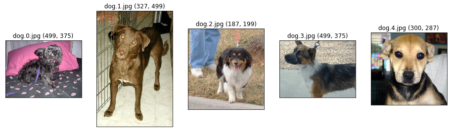

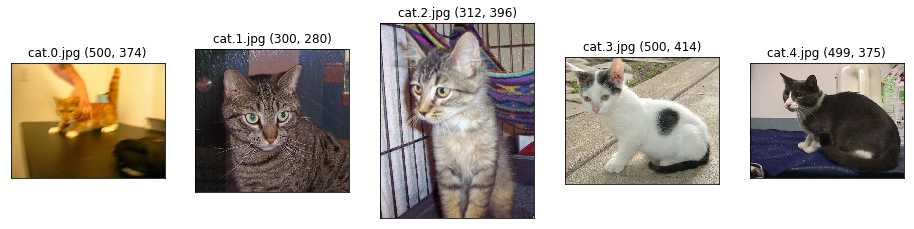

再对所有训练图片，打印出长宽的散点图，如下:
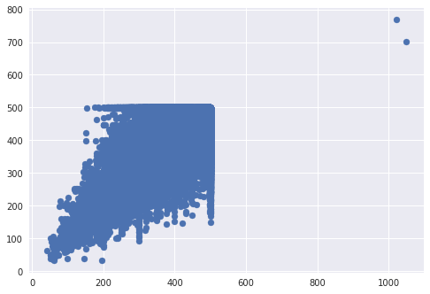

可以看到，确实图片的尺寸各异，但基本都是小尺寸的图。


进一步观察，我们还可以发现一些可能的异常值。比如，如下所示:

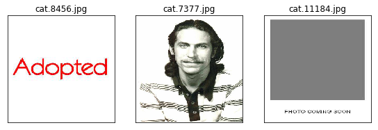

为了去掉这些异常值，我们借助``ImageNet``中预先训练好的模型``Xception``。``Xcepton``的在10个类的分类中Top-5分类准确度达到0.945，如果把Top-5改到更高的Top-N，准确度将更高。

我们用``Xception``的Top-20，各取前2500张猫狗图片进行测试，对预测分类，即不是猫也不是狗的图片输出如下：

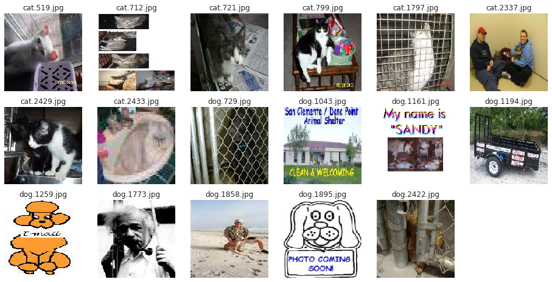

可以看到，上面这些图片大部分都难以识别，我们把其中明显与猫狗无关系的图片从训练集中去掉。


### 2.2 算法和技术

#### 2.2.1 深度学习

``深度学习``的概念源于``人工神经网络``的研究。含多隐层的``多层感知器``就是一种深度学习结构。深度学习通过组合低层特征形成更加抽象的高层表示属性类别或特征，以发现数据的分布式特征表示。

深度学习的概念由Hinton等人于2006年提出。其主要算法是``反向传播(BP)算法``。``BP算法``通过反向传播误差，来达到训练参数（权重）的目的。

深度学习随着计算机硬件的发展，中间的隐含层可以加到很多，可以大到几百层，参数的个数也达到几百万。深度学习已经应用于CNN、RNN、GAN等，对图像识别、文本分类、对抗网络等都有很大的应用。

#### 2.2.2 卷积网络

``Lecun``等人提出的卷积神经网络是第一个真正多层结构学习算法，它利用空间相对关系减少参数数目以提高训练性能。

卷积是基于``权重共享``的思想，比如一张图片，猫可能只是从左上角移到右下角，这部分可以用相同的权重映射到下一层的神经元。每个卷积层的每个滤波器可以学习到图片的一个特征，随着深度增加，模型会把学到的特征组合，并学到更高级的特征。

通过卷积和池化等技术，可以大规模降低训练参数，提高训练性能，同时减少了过拟合。

####  2.2.3 深度卷积网络

2012年的时候，``Alex Krizhevsky``使用``AlexNet``在``ImageNet``举办的``ILSVRC-2012``中达到了 ``15.3%``的top-5错误率，他使用了非常深的``ConvNet``。

现在主流的卷积网络架构更深了。比如：

| Model                                                        | Size   | Top-1 Accuracy | Top-5 Accuracy | Parameters | Depth |
| ------------------------------------------------------------ | ------ | -------------- | -------------- | ---------- | ----- |
| Xception          | 88 MB  | 0.790          | 0.945          | 22,910,480 | 126   |
| ResNet50          | 99 MB  | 0.759          | 0.929          | 25,636,712 | 168   |
| InceptionV3   | 92 MB  | 0.788          | 0.944          | 23,851,784 | 159   |
| InceptionResNetV2| 215 MB | 0.804          | 0.953          | 55,873,736 | 572   |

这些网络深度都有上百层，但Top-5 accuracy表现都非常好。

这些深度网络中都用到了``Inception``和``1x1卷积``的技术。

* Inception模块

  输入进来后，通常我们可以选择直接使用像素信息(1x1卷积)传递到下一层，也可以选择3x3卷积，可以选择5x5卷积，还可以选择max pooling的方式downsample刚被卷积后的feature maps。 但在实际的网络设计中，究竟该如何选择需要大量的实验和经验的。 Inception就不用我们来选择，而是将4个选项给神经网络，让网络自己去选择最合适的解决方案。

  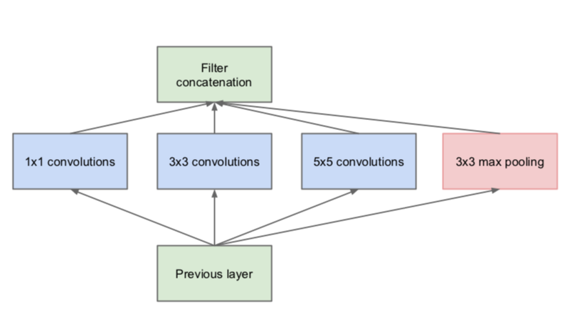

* 1x1 卷积

  这些1x1卷积的作用是为了让网络根据需要能够更灵活的控制数据的depth的。1x1卷积核，不考虑像素与周边其他像素关系，而是对该像素在不同的channels上进行线性组合（信息整合）且保留了图片的原有平面结构，调控depth就可以完成升维或降维的功能。引入1x1卷积后，可以把网络做得更深，同时也减少了参数大小，方便计算，下图是原始``Inception``引入1x1卷积核之后的示意图：

  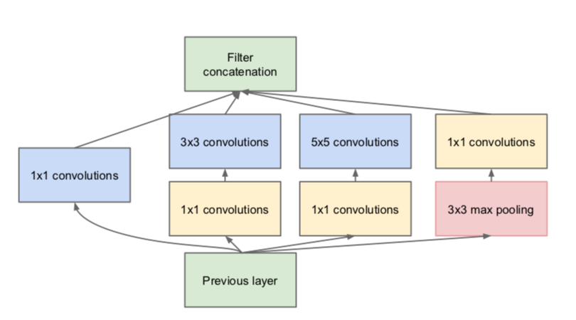


### 2.3 技术实现

要实现一个深度卷积网络，可以使用目前主流的深度计算框架，如TensorFlow、Caffe、Torch、MXNet、Theano等，还有更高层的封装``Keras``。

这些深度学习框架，都提供了张量、计算图等基础功能。

张量是所有深度学习框架中的通用数据格式。比如，可以把图片数据转化为三维张量 ``(width, height, color_depth) ``。通过将各种数据转化成张量，可以定义统一的数据结构，方便数据计算和表达。

深度学习框架还都提供了计算图功能。开发者先定义一个图的网络，如添加输入层、输出层、卷积层、池化层、Dropout、全连接层等，然后输入数据并启动图计算，就可以输出结果了。计算图的引入，开发者得以从宏观上掌握整个神经网络的内部结构，计算图也可以从决定代码运行时的 总体GPU 内存分配，以及分布式环境中不同底层设备间的相互协作方式。计算图还可以使计算模块化，方便高效。使用计算图，还可以把只训练某几层，导出某层的输出，导出某些层的权重数据等，使得模型微调成为可能。

由于深度学习网络的计算量非常大，需要用到``GPU``资源。``Nvidia`` 提供了对深度学习的硬件加速， ``cuDNN(CUDA Deep Neural Network)``，通过它，各种深度学习框架可以方便地协调``GPU``资源，使得深度学习的计算成为可能。

本项目使用了``Keras``提供的深度学习框架。``keras``是一个前端，它是对``tensorflow``或``Theano``等更底层库的高层API的封装，使用它非常方便。 ``Keras``的作者，``François Chollet``，也是``Xception``深度卷积网络的作者，提供了很多深度学习方面的技术共享。

### 2.4 基准测试

根据``Kaggle``上目前的[**Leaderboard**](https://www.kaggle.com/c/dogs-vs-cats-redux-kernels-edition/leaderboard)排行榜，要进入前10%，则``LogLoss``至少要少于``0.06127``。

训练深度ConvNet 需要大量的``GPU``资源与计算时间，受限于客观条件，项目不会对所有的25,000张图片进行训练，只会使用大概5,000张图片进行训练，所以项目设定的目标为分类对数损失分数小于 0.06。

## 3 方法

###  3.1 数据预处理

首先，我们看到图片的像素尺寸都不相同，我们需要把它们转成深度网络输入的格式。

然后，由于图片数据较大，不好一次加载进内存，我们需要构造数据生成器(``generator``)，让它分批加载数据，真正需要计算时才加载到内存。

这两个问题，都可以同过``keras``的图片处理库``keras.preprocessing.image``的``ImageDataGenerator``图片数据生成器解决。

```python
train_datagen = ImageDataGenerator(
        rescale=1./255,
        shear_range=0.2,
        zoom_range=0.2,
        horizontal_flip=True)
train_generator = train_datagen.flow_from_directory(
        train_data_dir,
        target_size=(img_height, img_width),
        batch_size=batch_size,
        class_mode='binary')
```

``ImageDataGenerator``还可以对图片数据进行变换，如缩放、平移变换、翻转等，适合小数据集训练时，做数据增强。

``flow_from_directory``可以对文件夹下的图片数据进行按``batch``流化，还能缩放成指定的图片大小。

``flow_from_directory``需要图片按分类放在各个分类目录下，如:

```
.
|----train
| |----cat
| | |----cat.1.jpg
| |----dog
| | |----dog.1.jpg
```

我们需要把目录处理成``train``、``validation``和``test``。

* ``train``中放训练的图片，需要按``dog``和``cat``子目录来放图片。
* ``validation``中放验证的图片，需要按``dog``和``cat``子目录进行存放。
* ``test``中放测试的图片。
* ``input``中放原全部数据集的图片，包含原有的``train``目录和原有的``test``目录。上面几个目录可以通过符号软链接，链接到这里的真实图片。

由于项目中用到``keras``中提供的各个预训练模型，我们注意到，各个模型对输入图片的大小还不一样。比如，

``Xception``和``InceptionResNetV2``的输入要求是``(299, 299, 3)``，而``InceptionV3``的输入要求是``(224, 224, 3)``。可以使用flow_fromdirectory生成指定尺寸的图片。

``Xception``、``InceptionResNetV2``、``InceptionV3``还会对输入的数据做预处理。如，``Xception``和``InceptionV3`` 和 ``Xception`` 这两个模型的图片预处理方式为将数据从(0，255)缩放到(-1, 1)区间内。一般每个模型会提供一个``preprocess_input`` 方法对输入进行处理。


### 3.2 实施

项目整体使用迁移学习的思想，项目充分使用``ImageNet``上做过预训练的模型学习到的特征。

鉴于计算图的强大，我们可以对``ImageNet``上做过预训练的模型进行微调(fine-tuning)，即对它们的top层进行微调，而保持前面卷积层的参数不变。也可以去掉它们的top，使用我们自己的top层，并训练top层参数。

#### 3.2.1 使用``fine-tuning``

比如我们参照``InceptionV3`这个模型，只训练最后三层(top层)的参数，如下所示:

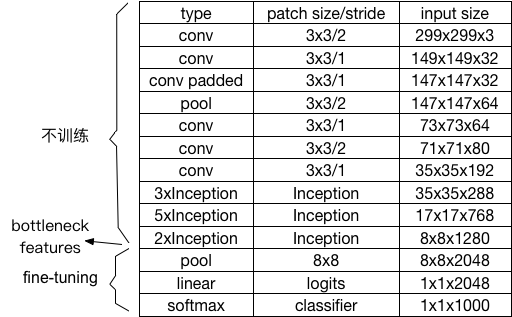


#### 3.2.2 使用自己的top层

我们也可以去掉预训练模型的top层，添加我们自己的池化层、全连接层、dropout等。

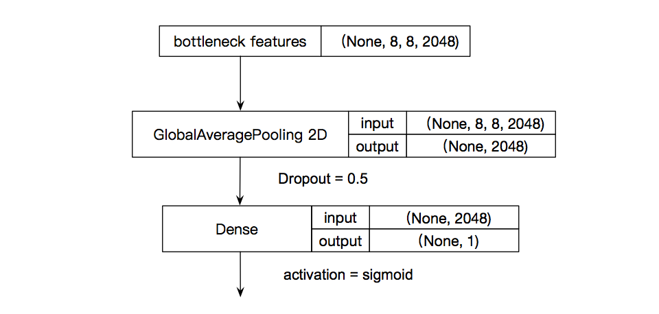

### 3.3 改进

在``3.2.2``的基础上， 我们可以试着整合多个模型的训练的特征输出，并添加我们的top层，并训练top层参数。其中，每个模型的输出可以用``h5y``存起来，方便以后训练时加载。为了统一模型输出，同时也减少存储大小，我们给每个模型的原有输出添加一个``GlobalAveragePooling2D``层，再输出，确保输出数据是2-dim的。

定义我们的整合模型，对合并的模型特征，再加Dropout和Dense。如下图所示，综合了``Xception``和``InceptionResNetV2``两个模型的特征并训练。我们也可以尝试综合更多的模型特征来进行测试。

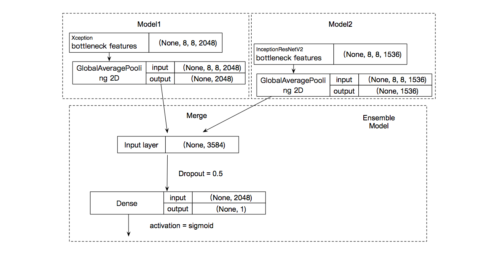

``Dense``输出到分类器，可以用``SGD``来做优化器，learning-rate取``0.001``。


## 4 结果

### 4.1 模型评价与验证

我们训练了Top-5排行比较高的``Xception``, ``InceptionResNetV2``的特征，并整合后，对5,000张图片进行训练，结果如下:

* 对``Xception``使用``EnsembleModel``

```
Train on 4000 samples, validate on 1000 samples
Epoch 1/50
4000/4000 [==============================] - 1s 267us/step - loss: 0.3334 - acc: 0.9387 - val_loss: 0.1782 - val_acc: 0.9920
Epoch 2/50
4000/4000 [==============================] - 1s 164us/step - loss: 0.1298 - acc: 0.9875 - val_loss: 0.0971 - val_acc: 0.9930
...
Epoch 50/50
4000/4000 [==============================] - 1s 165us/step - loss: 0.0134 - acc: 0.9955 - val_loss: 0.0174 - val_acc: 0.9960
```


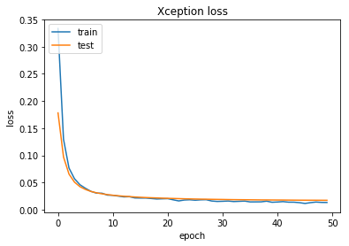

* 对``InceptionResNetV2``使用``EnsembleModel``

```
Train on 4000 samples, validate on 1000 samples
Epoch 1/50
4000/4000 [==============================] - 1s 165us/step - loss: 0.2917 - acc: 0.9150 - val_loss: 0.1389 - val_acc: 0.9870
Epoch 2/50
4000/4000 [==============================] - 1s 144us/step - loss: 0.1052 - acc: 0.9873 - val_loss: 0.0776 - val_acc: 0.9880
...
Epoch 22/50
4000/4000 [==============================]d - 1s 147us/step - loss: 0.0140 - acc: 0.9972 - val_loss: 0.0247 - val_acc: 0.9920
```


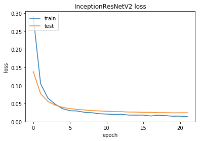

* 整合``InceptionResNetV2``和``Xception``特征后使用``EnsembleModel``

```
Train on 4000 samples, validate on 1000 samples
Epoch 1/50
4000/4000 [==============================] - 1s 267us/step - loss: 0.2271 - acc: 0.9525 - val_loss: 0.0904 - val_acc: 0.9920
Epoch 2/50
4000/4000 [==============================] - 1s 170us/step - loss: 0.0622 - acc: 0.9933 - val_loss: 0.0475 - val_acc: 0.9920
...
Epoch 22/50
4000/4000 [==============================] - 1s 172us/step - loss: 0.0064 - acc: 0.9980 - val_loss: 0.0172 - val_acc: 0.9940
```

  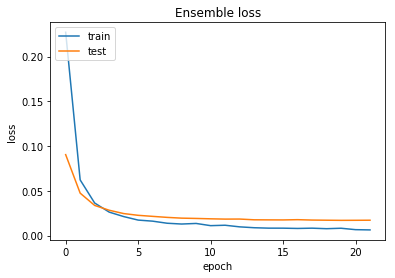

总体看，这些模型都取得了不错的效果。整合模型的效果也不错，val_loss达到0.0172。

### 4.2 测试集数据可视化

模型训练完，我们对测试数据额集进行预测，统计95%以上确定为猫狗，和5%确定为猫狗的次数，并抽取部分图片进行可视化:

```python
len(np.where(y_pred>0.95)[0]), len(np.where(y_pred<0.05)[0]), len(np.where((y_pred>0.5) & (y_pred<0.55))[0]), len(np.where((y_pred>0.45) & (y_pred<0.5))[0])
```

```
(6152, 6130, 3, 6)
```

* 95%以上确定是狗的:

  

* 95%以上确定是猫的:
  

* 5%以下确定是狗的:
  


* 5%以下确定是猫的:
  


### 4.3 测试集kaggle结果

用Kaggle的测试，Logloss是0.04093,达到了0.06的目标。


## 5. 结论

项目使用主流的深度卷积网络模型，对猫狗大赛的图片进行了训练。通过，调整这些模型的top层参数，或整合这些模型的特征输出，达到了``LogLoss`` ``0.06``的目标。

可以发现，使用迁移学习的思路，可以很方便的移植、调节、改进模型，特别是``ImageNet``上的预训练的模型真的非常强大，以后处理图片分类之类的问题，可以优先考虑使用这些模型。CNN的特性，也决定了这些模型可以预先训练，并共享权重。

可改进的方向，可以考虑加weight decay和drop out正则化并精细调参，可以试下衰减学习率的方法。

另外，由于硬件限制，我们模型只训练了5,000张图片，而加大训练数据往往可以提高模型准确率，待以后尝试。


## 参考文献

[1] Philippe Golle. Machine Learning Attacks Against the Asirra CAPTCHA. 2008.

[2] Alex Krizhevsky, Ilya Sutskever and Geoffrey E. Hinton. ImageNet Classification with Deep Convolutional
Neural Networks. 2012.

[3] K. Simonyan and A. Zisserman. Very deep convolutional networks for large-scale image recognition. In ICLR, 2015. 

[4] Sinno Jialin Pan and Qiang Yang Fellow. A Survey on Transfer Learning. IEEE, 2009.

[5] François Chollet. Building powerful image classification models using very little data. https://blog.keras.io/building-powerful-image-classification-models-using-very-little-data.html. Published: 2018-01-29.

[6] François Chollet. Xception: Deep Learning with Depthwise Separable Convolutions. 2017.

[7] Christian Szegedy, Vincent Vanhoucke, Sergey Ioffe, Jonathon Shlens, Zbigniew Wojna. Rethinking the Inception Architecture for Computer Vision. 2015.

[8] Gao Huang, Zhuang Liu, Laurens van der Maaten, Kilian Q. Weinberger. Densely Connected Convolutional Networks. 2016.

